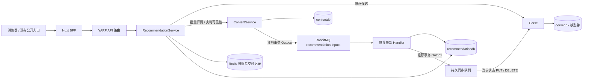

# RecommendationService 架构规划

规划日期：2026-10-08。状态：第一版独立服务已实现；本文保留设计依据及后续扩展要求，当前实现与验证见 [推荐接入说明](recommendations.md)。

本方案基于当前仓库的 Gorse 接入，不重新实现推荐算法。目标是将推荐查询、行为反馈和引擎同步移出 ContentService，使发帖、点赞、收藏不再等待 Gorse 网络请求，同时保留现有首页接口和内容审核边界。

## 1. 当前状态与拆分目标

拆分前 `RedNote.ContentService/Features/Recommendations` 同时承担推荐快照、分页、帖子详情组装、行为上报、Gorse 同步及启动回填。`RecommendationSync` 在 ContentService 的帖子写入事务中获取行锁，再等待 Gorse SDK。这保证了部分写入顺序，但 Gorse 的延迟会延长业务锁的占用。这套代码现已移除。

目标拆分为两个独立部署的组件：

- **RecommendationService**：推荐业务的查询和可靠同步服务，使用 .NET、EF Core、Wolverine、Redis。
- **Gorse**：推荐引擎，继续负责召回、训练和排序，第一版保留现有 all-in-one 容器。

独立服务不意味着立即拆出算法团队、训练平台、特征平台或多个 .NET 分层项目。第一版建立一个 `RedNote.RecommendationService` 项目，按功能组织。

## 2. 职责和数据所有权

| 组件 | 负责 | 数据所有权 |
| --- | --- | --- |
| ContentService | 帖子、标签、点赞、收藏、审核、删除、完整卡片查询 | `contentdb`，业务事实来源 |
| RecommendationService | 候选列表、稳定分页、反馈校验、推荐投影、同步和降级 | `recommendationdb`，可重建的推荐状态和同步记录 |
| Gorse | 协同过滤、相似召回、热度/最新召回、模型训练和排序 | `gorsedb`、Gorse Redis 键、模型卷 |
| Nuxt 前端 / BFF | 前端管理推荐与最新列表模式；BFF 负责会话、Token、参数校验和薄转发 | 复用现有前端和 BFF 基础设施 |
| YARP | 路由、认证策略、限流、健康探测 | 复用现有网关配置 |
| AdminService | 后续同步状态、重建操作的管理入口和审计 | 复用现有管理权限与审计 |

RecommendationService 不引用 `ContentServiceDbContext`，不直接查询 `contentdb`，不复制正文、图片签名地址、用户资料或 ContentService 的详情查询逻辑。它只通过事件接收必要事实，通过 Content 的公开批量查询获取展示内容。

`recommendationdb` 与 `gorsedb` 是不同的逻辑数据库；本地仍可共用现有 PostgreSQL 实例。前者由 EF 迁移和 Wolverine 管理，后者的表仍由 Gorse 自己维护。

## 3. 目标链路



开发环境的公网 YARP 可以仍位于 BFF 前方；图中的 YARP 表示 BFF 调用的 API 路由。服务间详情查询直接使用 Aspire 服务发现访问 Content，不再绕回网关。推荐服务和 Gorse 都不需要新增公开域名。

## 4. 查询由推荐服务聚合，BFF 保持薄转发

第一版选择 RecommendationService 内部批量调用 ContentService，而不是让 BFF 分别获取候选和详情。原因是候选扫描、隐藏内容补齐、实际交付记录和 `nextCursor` 必须一起决策；拆成两阶段会增加分页协议和状态协调。

复用现有 `POST /api/v1/posts/batch`：它已过滤非发布、隐藏和删除的帖子，恢复输入 ID 顺序，并使用 `PostResponseQueryService` 组装作者、图片和当前用户互动状态。通过 `IHttpClientFactory`、ServiceDefaults 服务发现及追踪调用，登录请求仅向受信任的 Content 地址转发已验证的 Bearer Token。

完整 FeedResponse 的 DTO 放入共享 Contracts，服务之间不引用彼此的可执行项目；DTO 不携带 EF 实体或业务实现。

保留现有外部契约：

| 接口 | 目标实现 |
| --- | --- |
| `GET /api/v1/posts/recommended?pageSize=20&cursor=...` | RecommendationService，GET 允许匿名 |
| `POST /api/v1/posts/recommendations/feedback` | RecommendationService，要求登录 |
| `/api/posts/recommended`、`/api/posts/recommendations/feedback` | 保留现有 Nuxt BFF 地址 |
| `/api/v1/posts/feed`、`/api/v1/posts/batch` | 继续由 ContentService 提供 |

YARP 为推荐查询和反馈添加精确路由，优先于现有 `/posts/{**rest}`；保留查询匿名、反馈认证的不同策略。批量详情使用 POST，但属于读取操作，不能把这一接口与其他 POST 业务写入共用无差别重试策略。

一次查询的步骤：

1. 根据 JWT `sub` 获取登录用户，向 Gorse 获取最多 500 个候选；匿名用户使用非个性化候选或最新内容，不共用一个持久的匿名兴趣用户。
2. 创建 Redis 快照：归属用户、固定顺序的候选 ID、来源策略、创建时间；有效期初始仍为 30 分钟。
3. 按候选顺序批量向 Content 获取详情。隐藏、删除或不存在的内容被跳过，继续补齐。
4. 记录本次**实际返回**的帖子 ID，再返回完整卡片、游标、`requestId` 和 `strategy`。
5. 下一页继续使用相同快照，每次重新经过 Content 可见性检查。

游标只推进已经扫描的候选。若预取超过本页所需数量，必须保留未消费位置，不能跳过尚未展示的有效帖子。设置批量调用次数和总查询预算，避免大量隐藏候选触发无上限循环；允许返回不足一页并正确标明是否仍有候选。

跨用户游标返回 403；快照过期返回 410，并由首页刷新会话。不能把请求推荐列表本身记为曝光。`strategy=gorse` 仅表示候选来源，不代表已证明个性化模型质量。

## 5. 跨服务事件必须携带可独立应用的事实

拆分前 `SyncRecommendationPreference(PostId, UserId, Type)` 是本地消息，消费者依赖 Content 数据库读取当前状态。不能直接将它移到 RabbitMQ 后继续按 ID 查 Content 数据库。

第一版新增两个设计中的事件契约，使用独立 `recommendation-inputs` 交换机和推荐消费队列。这样不会把新类型广播到当前订阅整个 `content-events` 的 SearchService。

| 设计中的事件 | 必需内容 | 触发 |
| --- | --- | --- |
| `RecommendationItemStateChanged` | PostId、AuthorUserId、Tags、CreatedAtUtc、Status、IsHidden、Revision | 发布、修改推荐相关元数据、隐藏/恢复、删除 |
| `RecommendationPreferenceStateChanged` | PostId、UserId、Kind、IsActive、Revision、OccurredAtUtc | 点赞/取消点赞、收藏/取消收藏 |

事件是本项目的业务契约，并非库 API；第一版已放入 Contracts。目录事件携带完整推荐事实，不含正文或图片 URL，Published 状态用 IsPublished 表示。

完整目录快照避免将“元数据变化”和“可见性变化”的部分事件错误地共用一个最新版本：例如先收到隐藏 v12，再收到编辑 v11，不能因此永久漏掉编辑中的新标签。使用完整快照时，v12 自身已经含有完整目录状态。

版本规则：

- 复用帖子在 Content 写锁内维护的单调 `Post.Revision`。收藏和取消收藏递增版本已补齐；每次有效偏好状态变化先递增版本，再构建事件。
- 目录按 PostId 比较版本；偏好按 `(UserId, PostId, Kind)` 比较版本。两个投影分别判断，不互相丢弃事件。
- Content 业务变更和事件写入同一个 Wolverine + EF 事务 Outbox；事件构建使用事务内新状态，避免未提交时查询到旧值。
- 推荐消费者在自己的 EF 事务中比较版本、更新状态并排入同步任务。并发版本检查必须由数据库约束/并发控制保护，不能只有无锁的 C# 判断。
- 取消操作保留 `IsActive=false` 和版本。删除帖子保留 tombstone，阻止旧事件和回填复活相同 ID。
- 偏好先于目录到达时，保存偏好状态并等待目录就绪，不伪造 Gorse item。

状态映射：非 Published 内容不可推荐，隐藏状态映射 Gorse `IsHidden`，删除 tombstone 使用 DELETE。偏好同步遇到删除状态时，不允许自动重建 item。

所有点赞/收藏事实来自 Content 的真实业务操作；浏览器反馈接口只接受 `read`、`click`。

## 6. 推荐库只保存必要状态

| 表 / 状态 | 主要字段和用途 |
| --- | --- |
| `RecommendationItems` | PostId、AuthorUserId、Tags、CreatedAtUtc、Status、IsHidden、SourceRevision；用于引擎目录和最新候选降级 |
| `RecommendationFeedbackStates` | UserId、PostId、Type、IsActive、SourceRevision / 本地状态版本、OccurredAtUtc；保存当前二值反馈及取消状态 |
| `FeedbackReceipts` | RequestId、UserId、PostId、Type、RecordedAtUtc；唯一键防止同次交付重复上报 |
| `ProjectionCheckpoints` | 初始化/重建任务的批次位置、状态和统计；不替代 Wolverine 消息存储 |

目录和反馈记录同时保存同步尝试所确认的版本 `LastAcknowledgedRevision` 及必要的错误/重试状态。该字段只表示收到某次 HTTP 成功响应，不表示 Gorse 已提供版本一致性保证。

Redis 保存短期候选快照和实际交付 ID。交付记录使用原生 Redis 操作追加，避免并发分页用读改写覆盖彼此的记录。关系数据、版本、取消状态不放在只靠 TTL 的缓存中。

Wolverine 已经管理 Inbox、Outbox、重试和错误队列，不另建一套通用消息表、后台任务平台或消息幂等框架。EF Core 直接负责持久化，不添加通用 Repository / UnitOfWork 包装层。

## 7. 先解决反馈幂等和 HTTP 边界

核查当前部署版本 Gorse `0.5.11` 和 NuGet `Gorse.NET 0.5.0` 后，有两个需要优先解决的问题：

1. 官方 `POST /api/feedback` 对重复反馈累加 `Value`，`PUT /api/feedback` 才覆盖。当前 SDK 的 `InsertFeedbackAsync` 使用 POST 且业务传 `Value=1`，重试和重复回填可能放大值；“只有一行”不等于值幂等。
2. 当前发布版 SDK 没有 CancellationToken、HttpClient 注入或业务可配置超时。`WaitAsync` 只限制调用方等待，底层网络请求仍可能继续。

新服务使用一个薄的 Typed HttpClient 适配器，仅封装必要的官方 REST 操作：候选查询、item 写入/删除、feedback PUT/DELETE。HTTP、连接池、服务发现、JSON、追踪、超时和熔断复用 .NET 现成能力，不重建完整 SDK 或推荐算法。

第一版反馈语义明确为二值：

- like/favorite：激活时 PUT `Value=1`，取消时 DELETE。
- read/click：保存接受的行为状态，PUT `Value=1`，使用服务端记录时间；同一个 RequestId 下重复上报由 Receipt 唯一键吸收。
- 如将来确实需要次数特征，由推荐库维护去重后的绝对计数，再 PUT；不依赖重试不安全的 POST 累加。

反馈必须属于该用户会话中**实际交付**的帖子，不能仅检查它是否在 500 个候选里。服务端据 JWT 确定用户，不能由请求体指定 UserId。校验交付范围说明它来自有效响应，不能证明客户端一定真实观看。

第一版 HTTP 单次请求为 5 秒预算，Feed 总预算 10 秒、Gorse 候选查询 3 秒，查询失败立即降级。写操作关闭 ServiceDefaults 通用自动重试，交给 Wolverine 每次读取最新状态后有限重试。查询专用熔断属于后续优化；认证/契约错误同样在有限重试后进入错误队列，不无限重试。

官方依据：[Gorse REST 反馈语义](https://gorse.io/docs/api/restful-api)、[发布版 SDK 反馈源码](https://raw.githubusercontent.com/gorse-io/Gorse.NET/cd7b04a5e8202931b84e50a10efcdcc5a4740468/Gorse.NET/API/FeedbackAPI.cs)、[发布版 SDK 构造源码](https://raw.githubusercontent.com/gorse-io/Gorse.NET/cd7b04a5e8202931b84e50a10efcdcc5a4740468/Gorse.NET/Gorse.cs)。

## 8. 同步流程和一致性边界

```text
Content 业务事务：更新事实 + Outbox 事件 → 返回业务成功
                       ↓
推荐投影事务：应用较新版本 + Outbox 同步任务
                       ↓
Gorse 同步队列：读取当前目标状态 → HTTP PUT / DELETE
                       ↓
短事务记录确认版本；若目标状态已变化，再次排入同步
```

网络调用不持有 Content 数据库锁，也不放在推荐投影的长事务内。队列中的消息主要用于唤醒同步；写入 Gorse 的内容取自推荐库的当前状态，不能照搬旧消息内的状态。

第一版部署约束：一个 RecommendationService 实例，一名活动 Gorse 写入者，同步队列消费并发度为 1。它能隔离 Content 写入并避免第一版并发写排序问题，但不具备多副本高可用。

扩多副本前，使用 Wolverine 已有的原生独占消费/全局分区能力，并将所有同 PostId 的目录、删除和反馈同步归入同一写入分区。普通本地并发度 1 不保证跨进程顺序；分区也不替代事件版本判断。实现前根据当前包版本编译并进行多实例故障测试，不自制分布式锁或分片路由平台。

Gorse HTTP API 不接受业务 Revision；推荐数据库事务与 Gorse 写入之间也没有分布式原子提交。即使 Typed HttpClient 真正发出取消，超时仍表示服务端提交结果未知。方案采用至少一次投递、绝对状态写入和最终对账，不能声称跨系统 exactly-once。

定期对账除了脏记录，还必须分批覆盖已确认的状态和删除 tombstone。例如旧 Insert 超时，随后 Delete 成功，但旧 Insert 在 Gorse 服务端迟到提交，仅扫描 Dirty 会漏掉这次复活。对账重新 PUT 当前有效状态、DELETE 当前取消/删除状态，让引擎最终收敛。

周期任务使用 Wolverine 原生延迟/周期消息，设置批量大小、运行预算和低优先级，不另写调度框架。展示安全继续依靠每页 Content 批量查询时的实时过滤；无法收回已经展示到浏览器上的旧响应。

官方依据：[Wolverine 持久消息](https://wolverine.netlify.app/guide/durability/)、[原生分组与分区处理](https://wolverine.netlify.app/guide/messaging/partitioning)。

## 9. 历史回填与重建

不再每次进程启动都全量扫描和导入。

首次导入和人工重建由显式、可续跑的 Wolverine 任务执行。导出逻辑留在 ContentService：用 EF keyset 分批读取目录和偏好，输出带版本的状态事件，推荐服务保存检查点。这样无需跨库访问，也无需新建通用数据同步平台。

先创建推荐持久队列并确认交换机绑定，再启用源服务的新事件发布，最后开始回填。RabbitMQ 没有订阅队列的交换机不能充当历史事件存储，不能以“以后启动消费者”代替这一步。批次读取采用一致的事务视图，确保状态与 Revision 匹配；实时事件和回填均经过相同版本规则，旧批次不能覆盖新状态。

迁移必须覆盖：

- 已隐藏和已删除的目录状态；不能只导出当前可见帖子。
- 当前有效的点赞、收藏，以及迁移时发现的已取消但仍留在引擎中的偏好。
- 现有 Gorse read/click 行为状态的保留和导入，避免拆分丢失已有测试/真实行为。
- 当前 POST 累加产生的 Value 按新的二值约定归一为 1，训练效果随后重新评估。

全新推荐库回填只导出活跃偏好时，必须配合空的目标引擎或与既存 Gorse 反馈做差异清理；不能因此默认现存取消状态已正确。迁移既存引擎时使用官方列表接口和 Content 所有的批量状态核对，不清空帖子或图片。

## 10. 故障和可观测性

| 故障 | 第一版行为 |
| --- | --- |
| Gorse 故障、熔断或无候选 | 推荐服务从目录投影取最新 ID，仍经 Content 批量过滤，`strategy=latest` |
| 推荐服务整体故障 | 前端清理推荐 cursor/requestId，切换现有 BFF `/api/posts/feed`，按最新 Feed 页码加载 |
| Redis 快照丢失/过期 | 返回 410，刷新会话；推荐缓存连接/超时映射 503。共享 Redis 整体故障还会影响 BFF 会话，需要后续隔离，不能承诺整体停机时首页可降级 |
| Content 详情查询故障 | 返回受控错误，不能用旧完整卡片绕过审核和删除检查 |
| RabbitMQ/Gorse 同步故障 | 使用持久消息重试、错误队列、告警；Content 正常业务不等待推荐同步 |

“最新 Feed”降级使用它已有的页码协议，不能把它的页码直接套入推荐 cursor；切换时重置分页会话，并暂停带推荐 RequestId 的 read/click 上报。前端需要增加显式列表模式，BFF 不把两种响应悄悄替换成同一个合同。

自动切换只针对超时、502/503/504 等可用性错误。400/401/403 保留参数或认证错误；410 先按原定义刷新推荐会话，持续失败时再考虑最新列表模式。

复用 `AddServiceDefaults` / `MapDefaultEndpoints`、OpenTelemetry、ProblemDetails、JWT 和 FluentValidation。反馈接口复用网关原生限流，按已认证用户限制提交频率与批量大小。Gorse 健康单独作为依赖指标；Gorse 不可用不能让推荐服务失去本来可用的最新内容降级路径。

第一版关注请求耗时、Gorse 超时和熔断、候选来源比例、快照失效率、批量详情过滤数量、投影延迟、最旧未完成同步年龄、错误队列和对账差异。日志记录 RequestId、TraceId、版本和批次数量，不输出 Token、API key 或完整用户行为正文。

算法质量独立验证：先积累可信曝光/点击样本，对比最新排序基线，再评估点击、收藏、内容覆盖与重复曝光。接口成功和 `strategy=gorse` 不是质量验收。

## 11. 项目和 Aspire 配置

```text
RedNote.RecommendationService/
  Program.cs
  Features/
    Feed/                         # 查询、快照、批量详情组合、降级
    Feedback/                     # read/click 校验与 Receipt
    Projection/                   # 接收 Content 状态事件
    Synchronization/              # 当前状态写入 Gorse、重试、对账
    Backfill/                     # 检查点与导入任务协调
  Infrastructure/
    Persistence/                  # DbContext、配置、EF migrations
    Gorse/                        # 必要官方 REST 操作的薄适配器
    Content/                      # 批量详情 Typed HttpClient
```

复用 Contracts、Authentication、ServiceDefaults；不为这个服务强行新增四个分层类库或重建 BFF、认证、缓存和消息基础设施。

AppHost 新增 `recommendationdb`、推荐项目及原生 EF migration 配置。推荐项目引用 Content 服务发现、RabbitMQ、Redis、推荐数据库，注入现有 JWT 配置与 Gorse secret。Gorse 凭据从 Content 移交推荐服务。Gateway 引用推荐服务，并加入精确推荐路由。

Gorse 不作为 Content 的启动或健康依赖。推荐服务的启动不能被 Gorse 未就绪阻塞，否则无法提供降级。共用 Redis 时保留独立键前缀；Gorse 库、模块、模型卷和私有 Dashboard 继续复用已有配置。

Docker 发布仍通过 AppHost 生成，加入推荐镜像和迁移任务；不手工维护第二套 Compose 文件。以后有容量需求再按 Gorse 原生 master/server/worker 拆分，业务 API 不随之变化。[Gorse 官方 Docker 部署](https://gorse.io/docs/deploy/docker)

## 12. 实施顺序和切换验收

| 优先级 / 阶段 | 工作 | 完成条件 |
| --- | --- | --- |
| P0 | 修正反馈 PUT 二值语义、可控 HTTP 边界和状态事件版本 | 重试、回填不放大 Value；取消后重放不恢复偏好 |
| P1 | 新服务、推荐库、Wolverine 投影和可靠队列、Aspire | 独立迁移/启动；不引用 Content DbContext；Gorse 不阻塞 Content |
| P2 | 有检查点回填、影子投影和对账 | 隐藏/删除/取消状态一致；旧事件、乱序、重复导入都通过 |
| P3 | Feed 聚合、Redis 会话、实际交付反馈验证、精确路由 | 现有前端完整卡片和稳定分页可用；跨用户访问被拒绝 |
| P4 | 停旧写入者并最终对账，灰度切换、清理 Content 推荐代码 | 同一 Gorse 不存在新旧两套写入者；最新 Feed 可作回退 |
| P5 | 容量和质量驱动的扩容/优化 | 多实例写入分区故障测试、算法对比数据足够后再扩展 |

影子阶段可以提前生成推荐投影，但不要让新旧服务同时修改生产 Gorse。需要测试新同步时使用隔离的 Gorse 或离线核对。切换时先停止旧同步消费者并处理在途任务，启用新同步、完成最终对账，再切换查询路由。

原 30 分钟 cursor 的所属缓存格式可能变化，新快照使用不同的版本前缀。切换时给旧 cursor 保留兼容期或明确返回 410 刷新；不能悄悄解释为新 cursor。回滚也必须明确同步写入者的所有权，不能重新开启两个消费者。

灰度观察窗可以暂时保留旧 Content 推荐查询，只读取 Gorse；旧同步消费者保持关闭。查询回退还需要考虑旧快照的反馈兼容性，不满足时改走最新 Feed 并暂停推荐反馈。清理旧查询后，恢复它需要回退镜像并重新核对路由和写入所有权，不能仅修改路由便承诺完成回滚。

最终清理 Content 的 `RecommendationFeed`、`RecommendationSync`、本地推荐队列、SDK 注册、启动回填和推荐专属配置；保留源事件发布和 Content 自己的 batch/latest 接口。删除 Redis 或包引用前确认是否还有其他功能依赖。

验收沿用现有 Alba 后端测试和真实 Docker/浏览器链路，不因为拆分换一套测试平台。新增测试集中覆盖反馈 Value 幂等、事件乱序、隐藏/删除与分页、SDK 替代适配、超时结果未知后的对账、Rabbit/Gorse 停机与恢复、用户隔离、历史回填续跑。未来多副本上线前另验原生分区所有权和节点故障恢复。

第一版已建立独立服务、投影库、迁移、版本事件、原生可靠队列和周期对账，切换网关/首页并移除旧写入者。Alba 与前端检查结果记录在接入说明；多副本所有权、灰度发布平台、专用指标面板和管理端重建仍是后续要求，不能将设计目标视为全部已实现。
