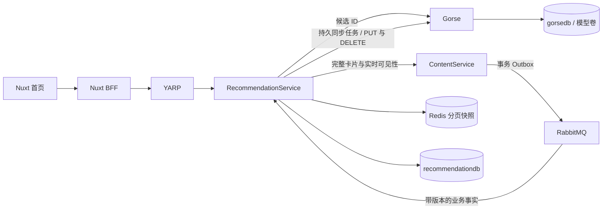

# Gorse 与独立推荐服务

2026-10-08：推荐查询、反馈、投影和引擎同步已移入 `RedNote.RecommendationService`。ContentService 保留帖子、点赞、收藏和审核的业务事实，以及批量卡片查询；不再持有 Gorse 凭据或调用 Gorse。

详细设计与扩展边界见 [推荐服务架构](recommendation-service-architecture.md)。

## 复用的能力

- Gorse `0.5.11`：召回、模型训练、排序。继续使用既有配置和 all-in-one 容器，不自行实现算法。
- EF Core / Aspire：独立 `recommendationdb`、迁移、服务发现和部署资源；推荐服务不引用 ContentService 项目或 DbContext。
- Wolverine：事务 Inbox/Outbox、RabbitMQ、持久本地队列、原生周期调度与延迟重试。
- `Aspire.StackExchange.Redis.DistributedCaching` / `IDistributedCache`：30 分钟候选快照及实际交付记录，前缀 `rednote:recommendations:v2:`；复用 Aspire Redis 连接、健康检查及遥测。
- JWT、ServiceDefaults、OpenTelemetry、ProblemDetails、FluentValidation 和网关原生限流继续复用。

已删除 `Gorse.NET` 依赖，使用 Typed HttpClient 对官方 REST 做薄适配。已核对的 SDK 版本会用 POST 累加反馈 Value，且缺少请求取消与超时注入入口。本实现使用 `PUT /api/feedback` 写绝对值 1，避免重试和回填放大行为权重；HttpClient 单次超时为 5 秒，写入重试由 Wolverine 执行。Feed 总预算 10 秒，其中 Gorse 候选查询最多 3 秒，取消会传到实际 HTTP 请求。

## 事实同步与一致性

Content 在业务事务中发布目录状态和点赞/收藏状态，包含源 Revision。推荐投影拒绝旧版本；删除记录保留终态，取消偏好保留非活跃状态。收藏变化也会递增帖子 Revision。新同步任务读取推荐库当前状态，HTTP 写入在 EF 事务之外执行，完成后按版本条件记录确认。

源请求交换机 `recommendation-source-requests` 绑定 `content-recommendation-source`；状态交换机 `recommendation-inputs` 绑定同名输入队列。两端使用原生 AutoProvision 提前建立绑定，避免首次启动时未订阅的消息丢失。

第一版只运行一个推荐服务实例，持久同步队列并行度为 1。这不提供跨实例写入所有权；多副本之前需要引入 Wolverine 原生分区/节点所有权并测试故障恢复。

同步故障按 5 秒、30 秒、2 分钟重试，耗尽后进入 Wolverine 错误队列。每 15 分钟原生调度分批对账所有目录，包括已确认记录、删除记录及非活跃偏好，以修复外部漂移或超时后迟到的写入。不能把它称为外部 HTTP 的 exactly-once。

## 首次导入

首次启动创建持久检查点，向 Content 请求每批 100 篇的 keyset 导出。Content 通过 EF 和短事务锁保持目录、偏好与版本一致；随后导入既存 Gorse 行为：保留 read/click，归一 Value，点赞/收藏交回 Content 核对，删除已取消但遗留在引擎中的偏好。

重启不会再次从头导入。检查点 `Phase=complete` 表示导入任务已排入可靠队列，不表示全部 Gorse 写入已经确认；还要检查版本确认字段与错误队列。现有帖子、图片和模型卷均保留。人工全量重建管理接口尚未实现。

## API 与首页

- `GET /api/v1/posts/recommended?pageSize=20&cursor=...`：完整卡片、nextCursor、hasMore、requestId、strategy；通过 YARP 精确路由到推荐服务。
- `POST /api/v1/posts/recommendations/feedback`：登录用户提交 `{requestId, items:[{postId,type}]}`，最多 50 条，只允许 read/click。网关按已认证用户限流。
- BFF 路径继续为 `/api/posts/recommended` 和 `/api/posts/recommendations/feedback`。
- 原 `/api/posts/feed` 最新内容接口保留。

最多固定 500 个候选 ID。每页通过 Content batch 重新检查当前可见性，并保持候选顺序；每次扫描批量不超过本页剩余位置，最多扫描 10 批。Content 请求转发当前用户授权，使点赞/收藏标记保持正确，不缓存完整卡片或图片签名地址。

反馈用户取 JWT sub，游标验证用户归属。反馈要求帖子确实交付给该用户，不能仅因为它存在于候选列表就上报。Receipt 去重，同一用户/帖子/行为的引擎 Value 为 1；客户端不能伪造 like/favorite。快照过期返回 410，首页刷新。

首页复用 VueUse 曝光计时：卡片至少 50% 可见、页面前台持续一秒才上报 read；打开详情上报 click。返回列表本身不代表曝光。

Gorse 不可用或无候选时，推荐服务从自己的目录投影取最新内容，再经 Content 过滤，返回 strategy=latest。推荐服务整体不可用时，前端切换原最新 Feed 页码模式，重置推荐游标并暂停推荐反馈。推荐缓存连接/超时及查询预算耗尽映射为 503，允许前端回退；400/401/403 不被可用性降级掩盖。共享 Redis 整体停机仍会影响 BFF 会话，不在已验证的首页降级保证内。

strategy=gorse 只证明候选来源，不证明算法质量。质量评估、专用同步指标面板和管理端重建功能属于后续工作。

## Aspire 与 Docker

推荐服务使用与现有 Aspire 包对齐的 `Aspire.StackExchange.Redis.DistributedCaching 13.5.4`。注册集中在 RecommendationConfiguration：`builder.AddRedisClientBuilder("redis").WithDistributedCache(...)`，Program 调用 `builder.AddRecommendations()`。原 `AddStackExchangeRedisCache` 注册已替换，业务继续依赖 IDistributedCache；AppHost 仍通过现有 AddRedis/WithReference 管理容器及连接信息。

AppHost 管理推荐项目、推荐 EF migration、私有 Gorse、gorsedb、模型卷和 Redis 模块。Gorse 表由引擎维护，不生成第三方 EF 实体；数据库初始化继续使用 PostgreSQL psql。Gorse 0.5 的 Redis 索引放在 0 号库，以 gorse: 前缀隔离。

API key / Dashboard 密码由 AppHost secret 参数传入推荐服务及 Gorse，Content 不再接收。Gorse readiness 不阻塞 Content 或推荐服务的启动和降级。无新增公网域名，也不向浏览器暴露 Gorse 8088 或推荐服务端口。

开发使用 `./scripts/start-dev.ps1`；Docker 使用 `./scripts/start-docker.ps1`，以 Aspire 生成的 Compose 和迁移镜像部署，不维护第二套手写 Compose。

开发模式的 Redis 主端点启用 TLS。Gorse 使用 `redis.Resource.UriExpression` 注入 `GORSE_CACHE_STORE`，由 Aspire 处理 redis/rediss 协议、端口和密码转义；不要在启动脚本固定拼接 redis://。容器使用 Aspire 注入的证书信任目录，保留证书验证。

推荐数据库资源在 AppHost 中与其他业务数据库一起声明，迁移统一在服务引用、JWT、健康检查及 JasperFx 调试命令配置完成之后注册。当前 EF 迁移预览集成在提前注册推荐迁移时，会使本地项目启动丢失已配置的连接字符串和监听地址；Docker Compose 部署通过不能替代本地 RunMode 验证。

## 验证

2026-10-09 修复并实际重启本地 Aspire 开发环境：Gorse 与推荐服务 Running，Gorse readiness 200，推荐服务 /health 与 /alive 200，网关及 BFF 推荐接口 200 并返回完整卡片；gorse-db-init 退出码 0、推荐迁移成功完成。推荐专项隔离回归 14/14 通过，包含特殊字符密码的 Redis URI。本次修复未重新部署 Docker Compose。

`./scripts/test-backend.ps1` 创建隔离 PostgreSQL、OpenSearch、Redis、Gorse，结束只清理本次测试容器。2026-10-08 独立推荐服务的 11 项 Alba 专项测试、2 项缓存故障响应测试及完整后端 122 项回归全部通过；前端 lint、类型检查及 24 项单元测试通过。

随后升级 Aspire 分布式缓存集成：AppHost 与测试项目编译零警告/零错误，推荐相关 14 项测试通过，新增检查覆盖原键前缀、30 分钟 TTL、原生 Redis 健康检查和 /health、/alive。此次缓存升级已完成代码与隔离测试验证；以下 Docker 镜像验证记录对应此前的推荐服务拆分版本，缓存升级尚未重新打包到该镜像。

专项测试覆盖实际 PUT Value 幂等、取消状态、版本乱序、删除终态、隐藏分页、实际交付反馈、用户隔离、历史迁移、外部漂移对账、Gorse 故障降级和 API key 校验。

本地 Docker 已实际部署并验证，镜像标签 `aspire-deploy-20261008152832`，所有迁移退出码为 0。推荐库目录 226 条，与 Content 总记录数一致；首次导入 complete，目录与反馈均无未确认版本，推荐 Wolverine 错误队列为空。已确认旧 content-recommendation-events 队列为空且没有消费者，再按 --if-empty/--if-unused 删除，避免旧绑定继续积压。

真实浏览器验证通过：OIDC 登录、两页各 20 篇且不重复、带图卡片和图片 200、read/click 204；点赞 PUT=1 和取消 DELETE 经真实 RabbitMQ 确认，并恢复测试前状态。实际停止 Gorse 后推荐服务返回最新候选；停止推荐服务后首页仍通过原 latest Feed 显示卡片。两服务均已恢复。

`npm run test:recommendations` 从忽略的本地批量测试账号文件读取账号，或使用 REDNOTE_TEST_EMAIL / REDNOTE_TEST_PASSWORD。验证登录、两页无重复、图片 200、曝光/点击 204；报告写入忽略的 artifacts/gorse-e2e-report.json，不含密码。

设置 REDNOTE_TEST_COMPOSE_PROJECT 为实际部署项目名，可额外运行真实队列和停机恢复检查。该模式会暂时停止指定本地项目的 gorse/recommendation-service 并在 finally 启动恢复，适用于本地测试；默认不停止任何服务。

官方资料：[REST API](https://gorse.io/docs/api/restful-api)、[Docker 部署](https://gorse.io/docs/deploy/docker)、[Wolverine 持久消息](https://wolverine.netlify.app/guide/durability/)。
